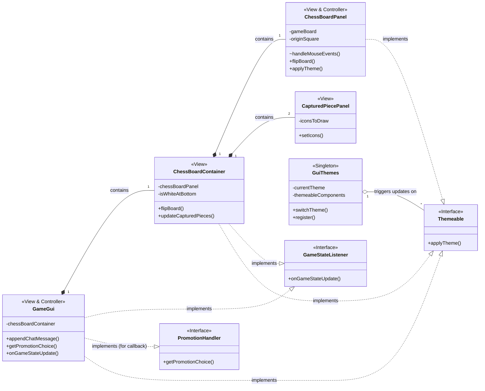

# COSC220 Chess GUI

A comprehensive chess graphical interface developed as part of a COSC220 team project. I served as lead GUI developer, designing and implementing the graphical interface layer for our multiplayer chess application, CheckMates.

**Note:** This repository contains only the GUI components I developed. The complete project requires game engine and network components that aren't included here as they're not my sole work to share.


*Five available themes: Classic, Pink Party, Van Beach, Rock Climbing & Chat, and minimalist*

## Features

* Full chess board visualization with piece rendering
* Interactive move selection via mouse clicks with legal move highlighting
* Multiple colour themes with dynamic switching
* Captured pieces display
* Move history and chat panels
* Game timers for both players
* Pawn promotion dialog with piece selection
* Board flip functionality for perspective switching
* Responsive design that maintains board square aspect ratio

## Architecture

The GUI follows a **Model-View-Controller (MVC)** pattern with the GUI components serving as both View and Controller, while the game engine (not included) acts as the Model.

### Key Design Patterns

**Observer Pattern**: The GUI components implement `GameStateListener` to receive updates from the game engine without direct coupling. When game state changes occur, the engine notifies all registered listeners, triggering appropriate visual updates.

**Observer with Callback**: Pawn promotion uses the `PromotionHandler` interface to pause the game engine thread while awaiting user selection. This was a particularly tricky piece of engineering, requiring the GUI to block the engine's thread (not just the EDT) until the user chooses their promotion piece.

**Singleton Pattern**: The `GuiThemes` enum manages theme switching globally, with all themeable components registering via the `Themeable` interface for dynamic restyling.

### Class Diagram



## Core Components

### GameGui
The main application panel and parent container for all visual elements. Manages the menu bar, timers, chat/move history panels, and hosts the pawn promotion dialogue popup.

### ChessBoardContainer
Manages the overall board layout including axis labels (A-H, 1-8) and captured piece displays. Enforces square aspect ratio for the chess board regardless of window dimensions.

### ChessBoardPanel
The interactive chess board itself. Handles piece rendering and processes all mouse events for piece selection and movement. Translates pixel coordinates to board positions and delegates move validation to the game engine.

### CapturedPiecePanel
Custom JPanel implementation that displays captured pieces responsively. Draws icons directly rather than using traditional Swing layout managers to achieve the specific flow-from-left behaviour required.

### GuiThemes
Smart Enum-based theme system managing five distinct colour schemes. Components register via the `Themeable` interface and are notified when users switch themes.

## Pawn Promotion Sequence

The pawn promotion demonstrates the sophisticated interaction between GUI and game engine through interfaces:


## Grid Validator API

A static utility library for validating movement patterns on 2D grids, extracted from our chess move validation logic. While the core movement logic was developed by Geoffrey Stewart-Richardson, I created the API abstraction to make it reusable across different grid-based contexts.

### Key Features
- Position validation within grid bounds
- Finding squares matching custom conditions
- Straight-line movement with optional blocking
- Adjacent square detection (4 or 8 directions)

### Example Usage
```java
// Define a check for empty squares
ObjectCheck isEmpty = new ObjectCheck() {
    @Override
    public boolean matches(Object obj) {
        return obj == null;
    }
};

// Get rook movement path until blocked
List<int[]> rookPath = GridValidator.getStraightLineUntilBlocked(
    row, col, direction, 7, board, isEmpty, false
);
```

The API uses simple `int[]` arrays for positions `[row, col]` and provides both position-based and object-based checking through the `PositionCheck` and `ObjectCheck` interfaces.

## Team Credits

**CheckMates Team (COSC220)**
- **Myself** - Lead GUI developer, GridValidator API abstraction
- **Geoffrey Stewart-Richardson** - Game engine architecture, original movement validation logic
- **Joshua Hahn** - Network architecture and server implementation
- **Curtis Martin** - Game logic and rule implementation

## Technical Notes

The GUI was designed for clear separation of concerns, allowing our distributed team to develop asynchronously. The View components contain no game logic—they simply reflect model state. The Controller responsibilities are distributed across GUI components based on their domain. This architecture enabled features like board flipping and theme switching without the View needing to understand chess rules.

The decision to use interfaces extensively (GameStateListener, PromotionHandler, Themeable) allowed the game engine to remain completely GUI-agnostic while still communicating state changes effectively.
